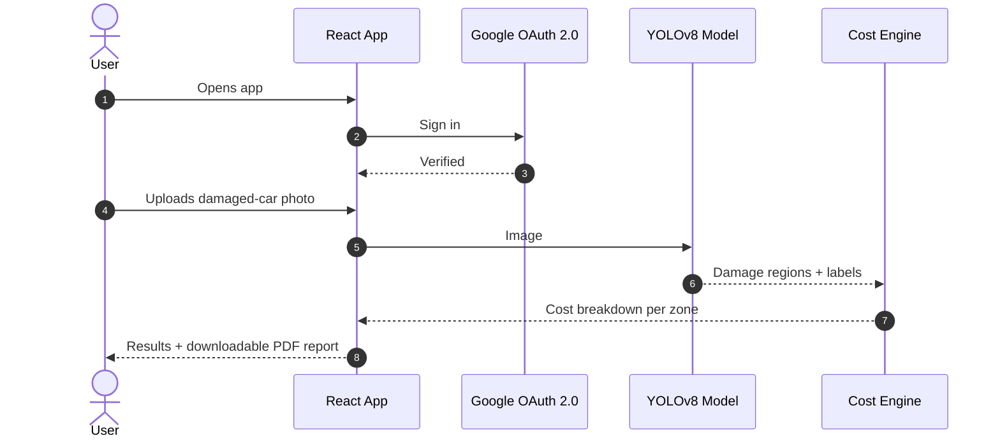

<div align="center">

<br/>
<a href="https://linkedin.com/in/kishorekumar521"></a>
<a href="https://kish-2004.github.io"></a>
<a href="https://my-vehicle-app.eastus.cloudapp.azure.com"></a>
<a href="https://geeksforgeeks.org/user/kishorekumai94/"></a>
 
</div>
<br/>
## `$ whoami`
 
```console
kishore@act-global:~$ neofetch
 
   ██╗  ██╗██╗  ██╗     kishore@github
   ██║ ██╔╝██║ ██╔╝     ─────────────────────────────
   █████╔╝ █████╔╝      Role      Full Stack + AI/ML Engineer
   ██╔═██╗ ██╔═██╗      Backend   Java · Spring Boot · Python
   ██║  ██╗██║  ██╗     Frontend  React · Angular
   ╚═╝  ╚═╝╚═╝  ╚═╝     AI        YOLOv8 · RAG · Agentic AI · Gemini
                        Cloud     Azure · Docker
                        Now       Building @ Act Global India
                        Shipped   1 live AI app on Azure
                        Status    ● open to work (remote / hybrid)
```
 
> I build systems that ship. My approach: understand the model, wire it into a real product, deploy it, and let people use it.
 
<br/>
## 🎯 Detection #1: the one that's live
 
<div align="center">
### 🚗 AI Vehicle Damage Estimator
 
[](https://my-vehicle-app.eastus.cloudapp.azure.com)
 
</div>

 
<details open>
<summary><b>What's inside</b></summary>
<br/>
| Layer | What it does |
|---|---|
| 🧠 **Vision** | YOLOv8 detects and localizes damage in a single photo |
| 💰 **Estimation** | Turns detected regions into a repair-cost breakdown |
| 📄 **Reporting** | Generates a professional PDF report |
| 🔐 **Auth** | Google OAuth 2.0 sign-in |
| 🐳 **Packaging** | Fully containerized with Docker |
| ☁️ **Hosting** | Live on Microsoft Azure |
 
</details>
<br/>
## 🧩 Detection #2 and #3: Act Global India internship
 
<table>
<tr>
<td width="50%" valign="top">
#### 📚 Course Registration System
`microservices` · `enterprise`
 
Student enrollment split into independent services: **Eureka** discovery, **API gateway** routing, and a **React** frontend over distributed **Spring Boot** APIs.
 
<sub>Java · Spring Boot · React · MySQL · Maven</sub>
 
[→ Repo](https://github.com/techadminactglobal/Act-Interns-2025/tree/main/KishoreKumar)
 
</td>
<td width="50%" valign="top">
#### 🤖 Document Chatbot
`RAG` · `Gemini`
 
Upload a document and chat with it. Full pipeline of ingestion, chunking, embeddings and retrieval, with an **Angular** chat UI and **Spring Boot** orchestration.
 
<sub>Java · Spring Boot · Angular · Gemini AI</sub>
 
[→ Repo](https://github.com/techadminactglobal/Act-Interns-2025/tree/main/KishoreKumar)
 
</td>
</tr>
</table>
<br/>
## 🧠 Classes I Can Detect (Skills)
 
```json
{
  "backend":   ["Java", "Spring Boot", "Python", "REST", "Microservices", "Maven"],
  "frontend":  ["React", "Angular", "JavaScript", "HTML5", "CSS3"],
  "ai_ml":     ["YOLOv8", "Computer Vision", "RAG", "Vector Embeddings", "Agentic AI", "Gemini", "Prompt Engineering"],
  "cloud":     ["Azure", "Docker", "Git", "GitHub"],
  "data":      ["MySQL"],
  "tools":     ["IntelliJ", "VS Code", "Spring Tool Suite", "Postman"]
}
```
 
<div align="center">

</div>
<br/>
## 📈 Telemetry
 
<div align="center">


</div>
<br/>
## 📡 `POST /hire-me`
 
```json
{
  "name": "Kishore Kumar",
  "open_to": ["Full Stack", "AI/ML", "Computer Vision"],
  "mode": ["remote", "hybrid"],
  "linkedin": "linkedin.com/in/kishorekumar521",
  "portfolio": "kish-2004.github.io",
  "response_time": "fast"
}
```
 
<div align="center">
[](https://linkedin.com/in/kishorekumar521)
[](https://kish-2004.github.io)
 
</div>
 