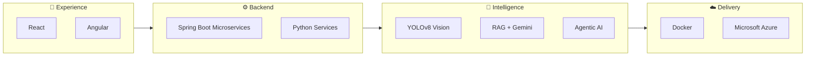
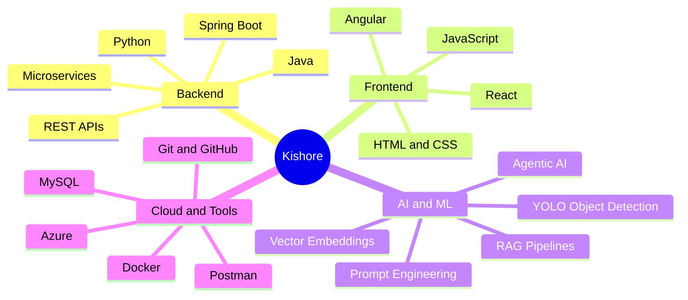

 

 

## ⚡ The One-Line Pitch

**I take an idea from database to UI to AI model to cloud, and I've done it three different ways.**

Computer vision. Distributed microservices. Generative AI with RAG. Three domains, one engineer who can build the whole stack.

 

## 🧬 How I Build: The Full Path

 

## 🎯 Three Projects · Three Domains

<table>
<tr>
<th width="33%">👁️ Computer Vision</th>
<th width="33%">🕸️ Distributed Systems</th>
<th width="33%">💬 Generative AI</th>
</tr>
<tr>
<td valign="top">

### Vehicle Damage Estimator
Photo in, damage regions and repair cost out.

- YOLOv8 damage detection
- Cost breakdown per zone
- PDF report export
- Google OAuth 2.0
- Dockerized, **live on Azure**

</td>
<td valign="top">

### Course Registration System
Enterprise-scale student enrollment as microservices.

- Eureka service discovery
- API gateway routing
- React UI over distributed REST APIs
- Built for Act Interns 2025

</td>
<td valign="top">

### Document Chatbot
Upload a document, then talk to it.

- Ingestion, chunking, embeddings, retrieval
- Gemini-grounded answers
- Spring Boot orchestration
- Angular chat interface

</td>
</tr>
</table>

 

## 🌳 Skill Tree

 

## 🤝 Hire Me If You Need Someone Who Can...

- ✅ Ship a **full-stack feature** end to end, backend to UI
- ✅ Add **AI to a real product**: vision, document Q&A, LLM features
- ✅ **Deploy and containerize** what they build instead of leaving it on localhost
- ✅ Work with **microservice architectures** (discovery, gateways, REST)

 

## 📈 Activity

 

## 📫 Let's Talk

I'm open to **Full Stack**, **AI/ML**, and **Computer Vision** roles, remote or hybrid.

